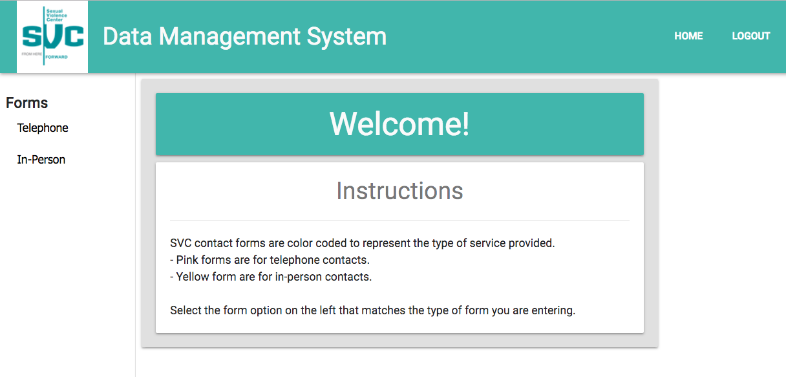
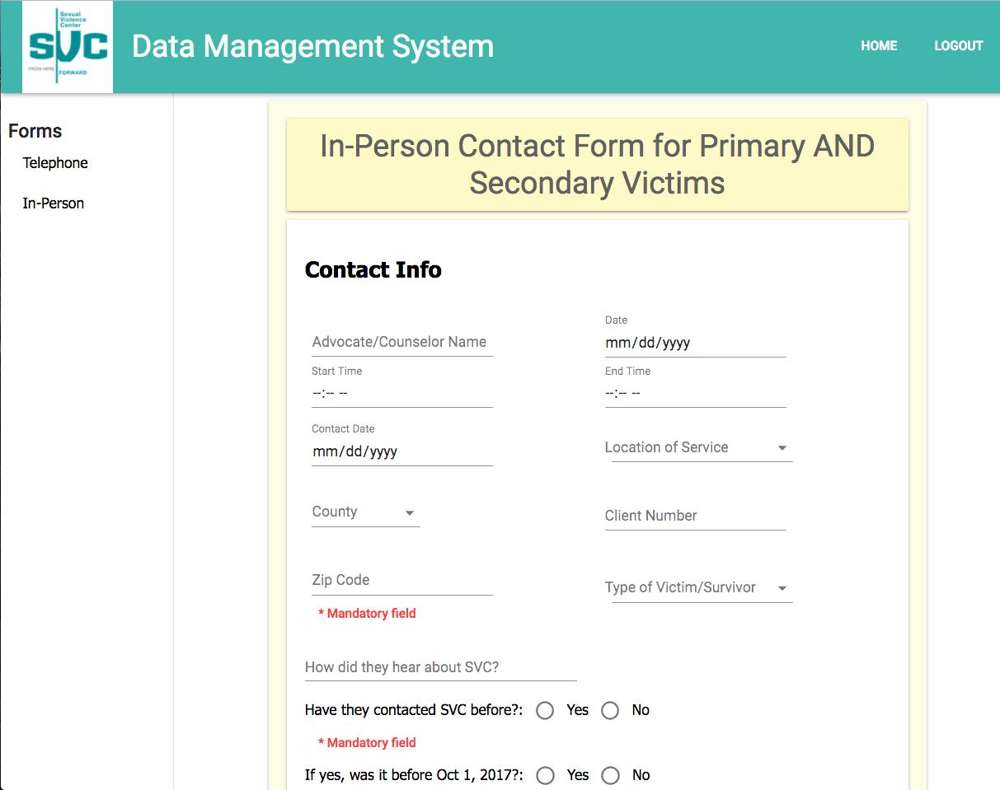
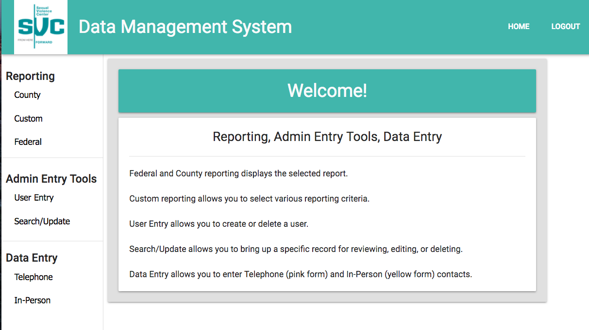
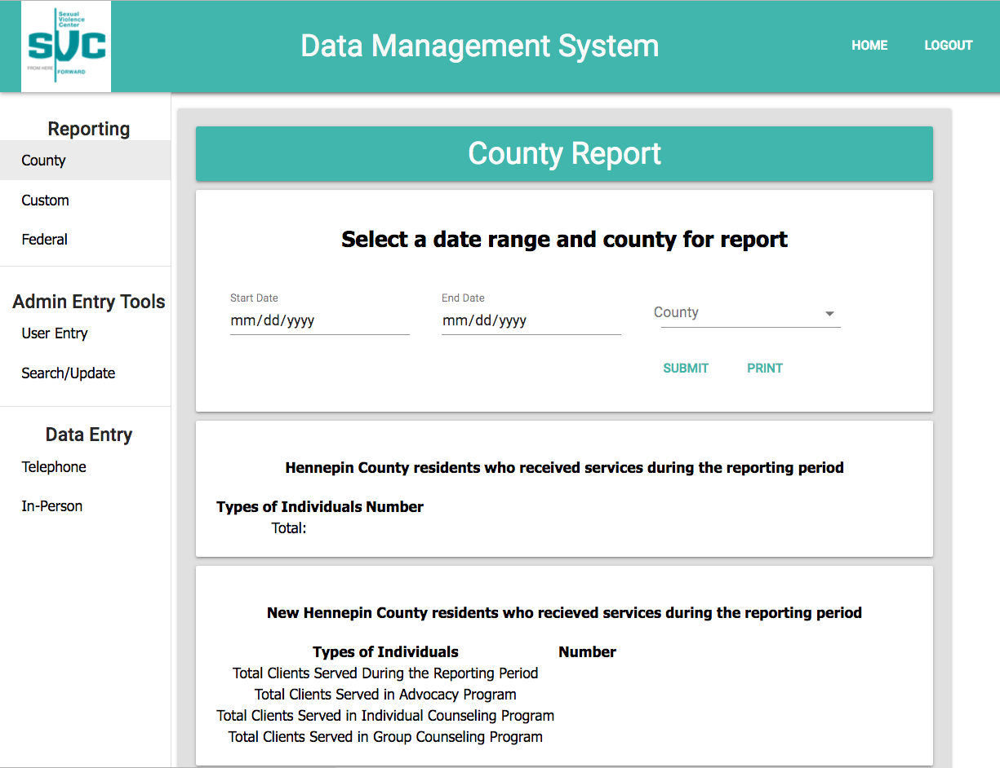
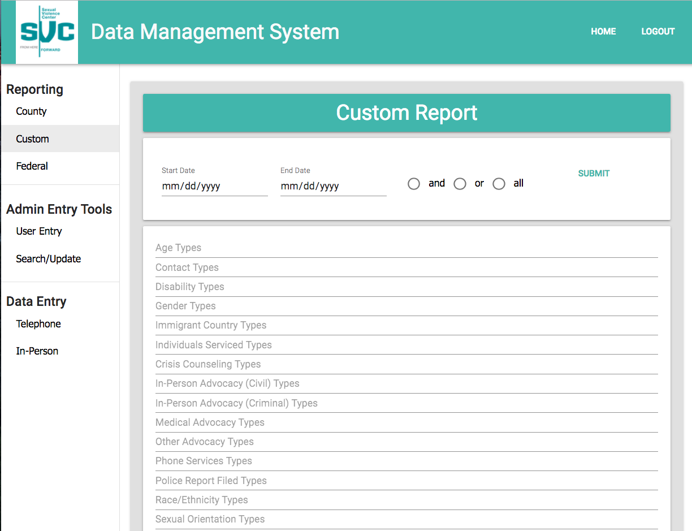
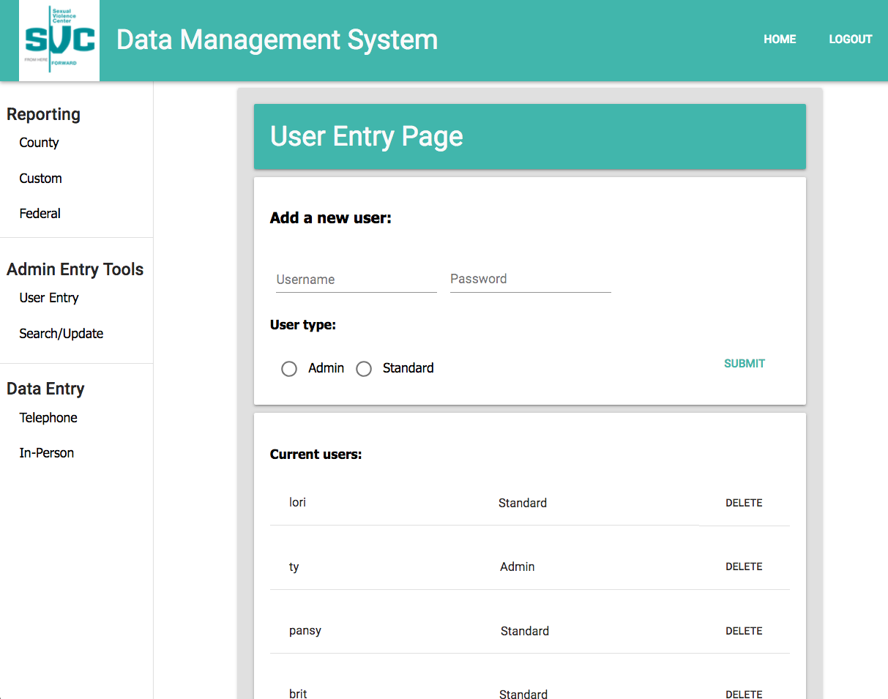

# Sexual Violence Center Data Management Tool

## Application Overview

The SVC Data Management Tool is a Single Page Application hosted on Heroku which runs in the browser. It facilitates entry of client interaction data, and it outputs reporting and statistical data for Sexual Violence Center. No personal identifying information is entered into or contained within the application. The data entry aligns with their current data collection forms. The reporting provides the specific data required for federal and county funding sources and flexible custom reporting capabilities to search various categories of data collected by SVC. There are two levels of access, Standard and Admin.

### Prerequisites

Before you get started, make sure you have the following software installed on your computer:

- [Node.js](https://nodejs.org/en/)
- [PostrgeSQL](https://www.postgresql.org/)
- [Nodemon](https://nodemon.io/)

### Download (Don't Clone) This Repository

* Don't Fork or Clone. Instead, click the `Clone or Download` button and select `Download Zip`.
* Unzip the project and start with the code in that folder.
* Create a new GitHub project and push this code to the new repository.

### Development Setup Instructions

* Run `npm install`
* Create a `.env` file at the root of the project and paste this line into the file:
    ```
    SERVER_SESSION_SECRET=superDuperSecret
    ```
    While you're in your new `.env` file, take the time to replace `superDuperSecret` with some long random string like `25POUbVtx6RKVNWszd9ERB9Bb6` to keep your application secure. Here's a site that can help you: [https://passwordsgenerator.net/](https://passwordsgenerator.net/). If you don't do this step, create a secret with less than eight characters, or leave it as `superDuperSecret`, you will get a warning.

* Start postgres if not running already by using `brew services start postgresql`
* Run `npm run dev`
* Navigate to `localhost:3000`

### Techology Used

- React
- Redux
- Material-UI/Next
- Node/Express
- PostgreSQL
- Heroku

### Database/SQL

db name = svc-data,
db table = person,
db table = victim

The SQL script is extensive. See the file database.sql in the root of this repo.

To add an Admin user after creating DB and Tables, run the following insert statement. Login, navigate to User Entry Page, add a new Admin user, test it works, then delete this test admin user.

INSERT INTO “person” (“username”, “password”, “user_type”) VALUES (‘ty’, ‘$2a$10$3ynnUgcr3FucUYuJm.Fs3uvvAtH3mFgN9vSQj5rLnbZid/pjviYXy’, true);

username: ty    password: ty

### Express/Passport with React

This version uses React to control the login requests and redirection in coordination with client-side routing.registration of users is controlled by Admins.

### Linting

The Airbnb ESLint for react is a part of this project. If you would like to take advantage of this in VS Code, you can add the `ESLint` extension. Click the `Extensions` button (the button right below the `Debug`) and search for `ESLint`. Click `install` for the first result and then click `Reload`. Then it should be all set up!

### Production Build

This is the build Heroku will run, but during development, you will likely not need to use it.

* Start postgres if not running already by using `brew services start postgresql`
* Run `npm start`
* Navigate to `localhost:5000`

### Deployment

1. Create a new Heroku project
2. Link the Heroku project to the project GitHub Repo
3. Create an Herkoku Postgres database
4. Connect to the Heroku Postgres database from Postico
5. Create the necessary tables
6. Add an environment variable for `SERVER_SESSION_SECRET` with a nice random string for security
7. In the deploy section, select manual deploy

### Lay of the Land

* `src/` contains the React application
* `public/` contains static assets for the client-side
* `build/` after you build the project, contains the transpiled code from `src/` and `public/` that will be viewed on the production site
* `server/` contains the Express App

### Views and Features

Upon login, Standard users and Admin users are presented different Landing Pages and Navigation bars. The navigation access allowed Standard users is a subset of the navigation access allowed Admin users. The Standard user's data entry views, Telephone and In-Person, are color-coded to match the color of the paper forms from which they are entering data.

#### Standard user examples:

Standard user landing page



Standard user contact form



#### Admin user examples:

Admin landing page



Admin County Report



Admin Custom Reporting



Admin User Entry Page



Admin Search and Update page


#### Authors

Blake Burbach, Brittany Marty, Sarah Bloomberg, Stephen Engler, and Ty Richardson
